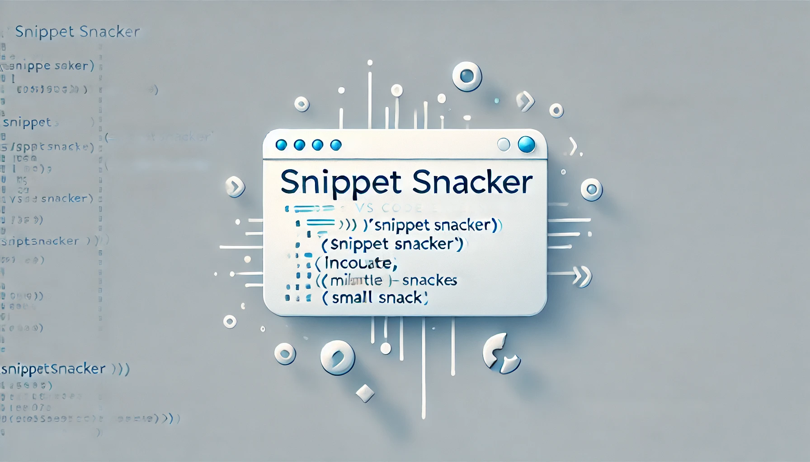

# Snippet Snacker

Welcome to **Snippet Snacker**—a VS Code extension that makes sharing code with your favorite AI assistants as easy as snacking! Quickly copy your selected code along with its relative file path, or append multiple snippets together, all from a nested context menu.

## Features

- **Copy Selected Snippet:**  
  Right-click to copy the selected code along with the file’s relative path to your clipboard.

- **Copy and Append Selected Snippet:**  
  Easily append additional code snippets to your clipboard without overwriting your previous selections.

- **Nested Context Menu:**  
  Find both commands neatly organized under the **Snippet Snacker** submenu when you right-click on a code selection.

> **Tip:** Use these features to quickly assemble code excerpts to share with AI assistants, colleagues, or for later review!

## Requirements

No extra dependencies are required. **Snippet Snacker** works out-of-the-box with VS Code (version 1.60.0 or later).

## Extension Settings

Currently, **Snippet Snacker** does not contribute additional settings. Enjoy the simplicity—no configuration needed!

## Known Issues

- **Clipboard Limitations:**  
  The extension relies on the VS Code clipboard API, so its behavior may vary slightly between operating systems.
- If you encounter any issues or unexpected behavior, please check the [GitHub issues page](https://github.com/or2008/snippet-snacker/issues) for support.

## Release Notes

### 0.0.1

- Initial release of **Snippet Snacker**
  - Added **Copy Selected Snippet** command
  - Added **Copy and Append Selected Snippet** command
  - Introduced a nested context menu for improved organization

**Enjoy snacking on those code bites with Snippet Snacker!**
